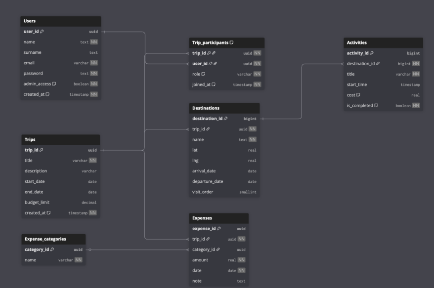

# Baza Danych – Europlanner

Dokument opisuje strukturę bazy danych aplikacji **Europlanner**. Źródło prawdy dla diagramu: [`ERD.dbml`](./ERD.dbml) (DBML) oraz [`ERD.png`](./ERD.png) (podgląd wizualny).

- **Silnik:** PostgreSQL (self‑hostowane Supabase na serwerze projektowym)
- **Dostęp:** przez **Tailscale / VPN** — adres typu `100.x.x.x:54323` (Supabase Studio) i `100.x.x.x:8000` (API). Cały zespół łączy się do **tej samej, jednej bazy**.
- **Autoryzacja:** ręczna — własna tabela `Users` z hasłem (kolumna `password`). Supabase Auth **nie jest** używane.
- **Edytor diagramu:** [dbdiagram.io](https://dbdiagram.io/d) — wklej zawartość `ERD.dbml`

> 🚨 **Ważne — nie ma migracji per developer.** Zespół ma **JEDNĄ wspólną bazę** dostępną przez VPN. Schemat zmienia się **raz**, w SQL Editorze Supabase Studio przez osobę z dostępem admin — i od razu jest widoczny dla wszystkich. **Nie uruchamiasz żadnych migracji lokalnie po `git pull`**. Snippety SQL w sekcji „[Historia zmian](#historia-zmian)" poniżej to **rejestr historyczny** dla referencji, NIE lista TODO.

> ⚠️ **Konwencja nazw:** wszystkie nazwy tabel w bazie są w **PascalCase** (np. `Users`, `Trips`, `Trip_participants`, `Expense_categories`). Nazwy kolumn — w `snake_case`, z jednym wyjątkiem: `Users.Admin_access` (z dużą `A`).

> 🤖 **Notka dla AI / LLM asystentów:** Jeśli widzisz w kodzie błąd typu `column "X" does not exist` — **NIE proponuj** developerowi uruchamiania `ALTER TABLE` u siebie. Zamiast tego zasugeruj: (1) sprawdzenie czy `NEXT_PUBLIC_SUPABASE_URL` w `.env.local` wskazuje na właściwy serwer firmowy, (2) skontaktowanie się z osobą zarządzającą wspólną bazą, żeby odpaliła odpowiedni snippet SQL raz na wspólnej instancji.

---

## Diagram ERD



---

## Tabele

### `Users` — użytkownicy aplikacji
Konta zarejestrowanych użytkowników. Hasło przechowywane w kolumnie `password` (logowanie obsługiwane w `app/api/auth/login/route.ts`).

| Kolumna | Typ | Uwagi |
|---|---|---|
| `user_id` | `uuid` | **PK** |
| `name` | `text` | Imię |
| `surname` | `text` | Nazwisko |
| `password` | `text` | NOT NULL |
| `Admin_access` | `boolean` | DEFAULT `false`. **Uwaga:** nazwa z dużej `A`. |
| `avatar_id` | `text` | FK logiczny → `lib/avatars.ts` (np. `yellow-smile`, `fox`). DEFAULT `'yellow-smile'`. |
| `email` | `text` | UNIQUE. Opcjonalne przy rejestracji. |

> 💡 W kodzie patrz: [`lib/auth/getCurrentUser.ts`](../lib/auth/getCurrentUser.ts), [`app/api/auth/register/route.ts`](../app/api/auth/register/route.ts).

---

### `Trips` — podróże
Centralny obiekt aplikacji — każda wyprawa ma swój budżet i ramy czasowe.

| Kolumna | Typ | Uwagi |
|---|---|---|
| `trip_id` | `uuid` | **PK** |
| `title` | `varchar` | NOT NULL — nazwa podróży |
| `description` | `varchar` | Opcjonalny opis |
| `start_date` | `date` | Data rozpoczęcia |
| `end_date` | `date` | Data zakończenia |
| `budget_limit` | `numeric` | Limit budżetu w EUR |
| `created_at` | `timestamp` | DEFAULT `now()` |
| `slug` | `text` | UNIQUE — używany w URL-ach (np. `/trips/wakacje-w-pradze-a3f9`). Generowany przez [`lib/slug.ts`](../lib/slug.ts). |

---

### `Trip_participants` — uczestnicy podróży (relacja M:N)
Łączy użytkowników z podróżami i przypisuje im role.

| Kolumna | Typ | Uwagi |
|---|---|---|
| `trip_id` | `uuid` | **PK**, FK → `Trips.trip_id` |
| `user_id` | `uuid` | **PK**, FK → `Users.user_id` |
| `role` | `varchar` | NOT NULL — dozwolone wartości: `owner`, `member` |
| `joined_at` | `timestamp` | DEFAULT `now()` |

> **Uwaga:** klucz główny to para `(trip_id, user_id)` — jeden użytkownik może być tylko raz uczestnikiem danej podróży.

---

### `Destinations` — miejsca docelowe w ramach podróży
Przystanki / miasta, które składają się na trasę podróży.

| Kolumna | Typ | Uwagi |
|---|---|---|
| `destination_id` | `bigint` (`int8`) | **PK**, auto-increment |
| `trip_id` | `uuid` | NOT NULL, FK → `Trips.trip_id` |
| `name` | `text` | NOT NULL — nazwa miasta / miejsca |
| `lat` | `real` (`float4`) | Szerokość geograficzna |
| `lng` | `real` (`float4`) | Długość geograficzna |
| `arrival_date` | `date` | Data przyjazdu |
| `departure_date` | `date` | Data wyjazdu |
| `visit_order` | `smallint` (`int2`) | Kolejność zwiedzania na trasie |

---

### `Activities` — aktywności w danym miejscu
Konkretne atrakcje / punkty programu przypisane do `Destinations`.

| Kolumna | Typ | Uwagi |
|---|---|---|
| `activity_id` | `bigint` (`int8`) | **PK**, auto-increment |
| `destination_id` | `bigint` (`int8`) | NOT NULL, FK → `Destinations.destination_id` |
| `title` | `varchar` | Nazwa aktywności |
| `start_time` | `timestamp` | Godzina rozpoczęcia |
| `cost` | `real` (`float4`) | Orientacyjny koszt |
| `is_completed` | `boolean` | DEFAULT `false` — czy aktywność została zrealizowana |

---

### `Expense_categories` — słownik kategorii wydatków
Lista predefiniowanych kategorii (np. transport, jedzenie, noclegi).

| Kolumna | Typ | Uwagi |
|---|---|---|
| `category_id` | `uuid` | **PK** |
| `name` | `varchar` | Nazwa kategorii |

**Proponowane wartości seed:**
- `Transport`
- `Jedzenie`
- `Noclegi`
- `Atrakcje`
- `Zakupy`
- `Inne`

---

### `Expenses` — wydatki
Pojedyncze wydatki poniesione w ramach podróży, przypisane do kategorii.

| Kolumna | Typ | Uwagi |
|---|---|---|
| `expense_id` | `uuid` | **PK** |
| `trip_id` | `uuid` | NOT NULL, FK → `Trips.trip_id` |
| `category_id` | `uuid` | NOT NULL, FK → `Expense_categories.category_id` |
| `amount` | `real` (`float4`) | NOT NULL — kwota |
| `date` | `date` | NOT NULL — data wydatku |
| `note` | `text` | Opcjonalna notatka / opis paragonu |

---

## Relacje

| Od | Kardynalność | Do | Znaczenie |
|---|---|---|---|
| `Users` | 1 : N | `Trip_participants` | użytkownik uczestniczy w wielu podróżach |
| `Trips` | 1 : N | `Trip_participants` | podróż ma wielu uczestników |
| `Trips` | 1 : N | `Destinations` | podróż składa się z wielu miejsc |
| `Destinations` | 1 : N | `Activities` | w miejscu dzieje się wiele aktywności |
| `Trips` | 1 : N | `Expenses` | podróż ma wiele wydatków |
| `Expense_categories` | 1 : N | `Expenses` | kategoria grupuje wiele wydatków |

---

## Konwencje

- **Nazwy tabel:** `PascalCase` (np. `Users`, `Trip_participants`). Cały kod w `app/api/**` i `lib/**` używa właśnie tej formy — nie zmieniać na lowercase, bo zapytania przestaną działać.
- **Klucze główne:** `uuid` dla obiektów biznesowych (`Users`, `Trips`, `Expenses`, `Expense_categories`), `bigint` auto-increment dla zasobów technicznych (`Destinations`, `Activities`).
- **Znaczniki czasu:** `timestamp` z `DEFAULT now()` dla `created_at` / `joined_at`.
- **Waluta:** kwoty w `Expenses.amount` przechowywane w EUR (przeliczenie z waluty oryginalnej paragonu odbywa się w aplikacji na podstawie kursów EBC — patrz [README.md](../README.md)).
- **Kaskady:** zaleca się `ON DELETE CASCADE` dla FK z `trip_id` (usunięcie podróży kasuje uczestników, destynacje i wydatki).

---

## 🛠️ Migracje — jak wprowadzać zmiany w schemacie

> Projekt **nie korzysta z formalnego narzędzia migracyjnego** (Prisma / Drizzle / `supabase migration`) **ani z migracji per‑developer**. Cały zespół pracuje na **jednej wspólnej bazie** (self‑hostowane Supabase, dostęp przez Tailscale/VPN), więc schemat zmienia się raz, centralnie.

### Procedura zmiany schematu (dla osoby z dostępem admin)

Kiedy potrzebujesz dodać kolumnę / tabelę / indeks:

1. **Zmodyfikuj [`ERD.dbml`](./ERD.dbml)** w repo (źródło prawdy diagramu).
2. **Wklej DBML na [dbdiagram.io](https://dbdiagram.io/d)**, wyeksportuj nowy PNG i nadpisz [`ERD.png`](./ERD.png).
3. **Zaktualizuj ten dokument** — dodaj/zmień opis kolumny w sekcji „[Tabele](#tabele)" wyżej.
4. **Dopisz snippet SQL do „[Historia zmian](#historia-zmian)" poniżej** — to **rejestr historyczny** (żeby reszta zespołu wiedziała co i kiedy się zmieniło + dla AI asystentów do kontekstu).
5. **Otwórz Supabase Studio przez VPN** (`http://100.x.x.x:54323`) → **SQL Editor** → **New query** → wklej snippet → **Run**. **Robisz to raz — zmiana jest natychmiast widoczna dla wszystkich w zespole.**
6. **Commit i push** zmian w repo (DBML + PNG + DATABASE.md). Reszta zespołu po `git pull` **nie musi nic odpalać** — baza jest już zaktualizowana.

### Dla pozostałych członków zespołu

**Nie musisz robić nic** po `git pull`. Zmiany w schemacie są już aktywne na wspólnej bazie. Wystarczy:

```bash
git pull origin main
npm install
npm run dev:fresh   # tylko czyszczenie cache .next
```

Jeśli widzisz błąd typu `column "X" does not exist` — patrz [README → Troubleshooting](../README.md#troubleshooting).

### Historia zmian

> 📌 **Sekcja informacyjna.** Snippety poniżej już zostały wykonane na wspólnej bazie — **nie odpalaj ich lokalnie**.

#### 2025‑11 — `Users.email` (logowanie i edycja konta)
> Commit: `b27a03a feat(account): kolumna email + edycja danych konta w ustawieniach`

```sql
ALTER TABLE "Users"
  ADD COLUMN IF NOT EXISTS email text;

CREATE UNIQUE INDEX IF NOT EXISTS users_email_unique
  ON "Users" (lower(email))
  WHERE email IS NOT NULL;
```

#### 2025‑11 — `Users.avatar_id` (wybór awatara)
> Commit: `9f382c3 feat(avatars): wybór awatara per użytkownik z zapisem do bazy`

```sql
ALTER TABLE "Users"
  ADD COLUMN IF NOT EXISTS avatar_id text DEFAULT 'yellow-smile';

UPDATE "Users" SET avatar_id = 'yellow-smile' WHERE avatar_id IS NULL;
```

#### 2025‑11 — `Trips.slug` (przyjazne URL-e)
> Commit: `532cd80 feat(trips): URL-e ze slug-iem zamiast UUID`

```sql
ALTER TABLE "Trips"
  ADD COLUMN IF NOT EXISTS slug text;

CREATE UNIQUE INDEX IF NOT EXISTS trips_slug_unique
  ON "Trips" (slug)
  WHERE slug IS NOT NULL;

-- Wypełnij slugi dla istniejących wierszy (jeden raz, ręcznie):
-- UPDATE "Trips" SET slug = lower(regexp_replace(title, '[^a-zA-Z0-9]+', '-', 'g')) || '-' || substr(trip_id::text, 1, 4) WHERE slug IS NULL;

ALTER TABLE "Trips" ALTER COLUMN slug SET NOT NULL;
```

### Jak sprawdzić, czy łączysz się do dobrej bazy

Czasem warto się upewnić, że `.env.local` wskazuje na firmową bazę (przez VPN), a nie np. starą instancję Supabase Cloud. Po wejściu na Supabase Studio (`http://100.x.x.x:54323`) w **SQL Editor** wklej:

```sql
-- Powinno zwrócić wszystkie 7 tabel:
SELECT tablename FROM pg_tables
WHERE schemaname = 'public'
ORDER BY tablename;

-- Powinno zwrócić name, surname, password, Admin_access, avatar_id, email:
SELECT column_name FROM information_schema.columns
WHERE table_schema = 'public' AND table_name = 'Users';

-- Powinno zawierać slug:
SELECT column_name FROM information_schema.columns
WHERE table_schema = 'public' AND table_name = 'Trips';
```

Jeśli czegoś brakuje — to znaczy że **łączysz się do złej bazy** (np. własnej Supabase Cloud zamiast firmowej self‑hostowanej). Sprawdź `NEXT_PUBLIC_SUPABASE_URL` w `.env.local` — powinien zaczynać się od adresu Tailscale `100.x.x.x`.

> 🛟 **Fallback w kodzie:** [`lib/auth/getCurrentUser.ts`](../lib/auth/getCurrentUser.ts) ma defensywny `try/catch` na wypadek nieaktualnej bazy — w logach pojawi się `[getCurrentUser] Brak kolumny email/avatar_id`. To znaczy że łączysz się do bazy bez tych kolumn (najpewniej do złej instancji — sprawdź URL).
